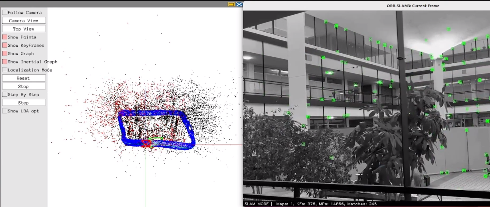

# Visual SLAM in Dynamic Environments

    

## 📌 Overview

This project implements a robust **Visual SLAM pipeline** capable of operating in **dynamic environments**, where moving objects (e.g., people, vehicles) can interfere with traditional feature-based localization and mapping. By detecting and filtering dynamic objects, the system maintains accurate localization and map consistency. The given photo above is an architectural building in the University of Minnesota, where we performed our first milestone using the Visual SLAM algorithm where only static feautures were present. 

(**LOOK UP THE PRESENTATION LINK AT THE BOTTOM FOR A MORE INTUITIVE UNDERSTANDING**)

> 🧠 Built during my graduate coursework at the University of Minnesota (CSCI 5561 - Computer Vision).  
> 🔍 Core modules include: ORB feature tracking, dynamic object detection using YOLO/Mask R-CNN, visual odometry, and bundle adjustment.

For the owner: https://docs.google.com/document/d/1d98b0ul8DAbsA6pQdtcuoIs5RCLXsdhCS047mxy8j9w/edit?tab=t.0

---

## 🎯 Objectives

- Enable robust localization in non-static scenes
- Filter dynamic features that degrade map quality
- Combine classical SLAM with deep learning-based perception
- Validate with public datasets and real-world video input

---

## 🚀 Features

- ORB-based keypoint extraction and matching
- YOLOv5 / Mask R-CNN for dynamic object segmentation
- Visual odometry with frame-to-frame pose estimation
- Keyframe selection and graph-based optimization
- Bundle adjustment for global consistency
- Visualization with Pangolin (3D map, trajectory, keypoints)

---
## Presentation
https://docs.google.com/presentation/d/1OyZ4Ogx_ZLECr_UY7OXu8BlClwnN3eTwHzgSxzgS4i4/edit?usp=drive_link
